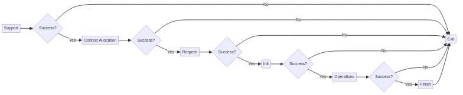

# Key Terminologies


# Introduction

  AOCL-Cryptograpy is an alternative to many cryptographic libraries like openssl, intel's IPP-CP, wolfssl etc. Integrating a new library into an already exisiting application can be difficult. Understanding this difficulty for the developers to switch from already existing libraries, we developed wrappers and providers which will help you integrate your application with AOCL-Cryptograpy in a matter of minutes. If your application is already using ether one of (OpenSSL, IPP-CP), you can use our provider or wrapper to test out the performance delivered by AOCL-Cryptography or even integrate it permanently.

  Using AOCL-Crypto's Native API is better than using Providers or Wrappers as there are some performance overheads associated with them. Our suggested workflow is to get stated with the Providers or Wrapper interfaces, once convinced with the performance, dedicate effort to move to native API.

  Link to other documentations:

  1. [AOCL-Crypto API Documentation](https://docs.amd.com/r/en-US/63862-AOCL-cryptography/AOCL-Cryptography-Library-63862)
  
  2. [AOCL Documentation](https://www.amd.com/en/developer/aocl.html)

## What to use?

### New Application

  If you are developing a new application, its recommended to use AOCL-Crypto's native C-API. One more alternative will be to write for OpenSSL and use the Provider interface, but it will have overheads from OpenSSL hence recommended to use AOCL-Cryptography native API.

  Please continue reading [Getting Started](#getting-started)

### Already Existing Application
  If you trying to integrate with already exisiting application, it will take time for you to change from your current library provider to AOCL-Cryptography in one go. Hence we recommend you to use OpenSSL provider (if already using OpenSSL) or (IPP Provider), then rewrite the parts of your code step by step slowly until you replace the dependency with OpenSSL or IPP.

#### OpenSSL 3.x Based Application
  Application based on OpenSSL can easily use AOCL-Crypto by configuring it to use the provider. AOCL-Crypto's OpenSSL provider documentation found in the API documentation, will provide the necessary steps to configure openssl provider for your application. Taking each module, removing OpenSSL code, and replacing with AOCL-Crypto API will allow you to slowly migrate to AOCL-Cryptography without too much effort.

#### IPP-CP based Application
  Application based on IPP-CP can easily use AOCL-Crypto by configuring it to use the wrapper, IPP-CP provider documentation can be found in the API documentation. Taking each module, removing IPP-CP code, and replacing with AOCL-Crypto API will allow you to slowly migrate to AOCL-Cryptography without too much effort. Note:   (Note: IPP  Compat  library is in experimental  state in 5.0 release)

#### Other library based Application
  Other Libraries can be a fork of OpenSSL or IPP-CP, in that case the provider or wrapper interface may still work, its not recommended to use provider or wrapper interface in the perticular situation as it may result in undefined behaviour in the cryptographic application and this can cause security vulnerabilities. Some other libraries like libsodium, libsalt, WolfSSL, MbedTLS etc does not have any provider or wrapper implementation.

  To migrate from Other Library to AOCL-Cryptography, you can slowly phase out the code which which calls the Other Library and replace it with AOCL-Cryptography, one disadvantage of this approach is that only the part you have replaced with AOCL-Crypto API will be using AOCL-Crypto hence there is still a dependency to the depreciated crypto library.


# Getting Started


All the examples shown here are available under examples section, if you have recieved a binary tarball or source code, there should be an `examples` directory. In this examples directory there are working examples which you can compile and run.

For a binary tarball you should be able to run `make` command on the root directory to compile the examples.

For more info go to doxygen

## Flow of AOCL-Crypto

Life cycle of any algorithm of AOCL-Crypto is divided into 5 steps.

1. Context Allocation - `alc_<algo>_handle_t handle` contains context `handle.context`, this context is used for storing information internal to AOCL Crypto. You can allocate the context by involking  `handle.context = malloc(alcp_<algo>_context_size(info))`. As this memory is allocated by the application, deallocation has to be handled by the application itself.

2. Request - Requesting a context from AOCL-Crypto will finalize the internal paths required to achieve the requested task.
Certain APIS also have an API to check for support, `alcp_<algo>_supported(alc_<algo>_info_t)` indicating based on the given info whether the algorithm is supported. You can request by invoking `alcp_<algo>_request(&info,handle)`.

3. Init - Initialise the handle with the input variables depending on the algorithm. For example, for cipher init will take key and iv as input arguments.

4. Core Operation - Core Operations of the algorithm involes feeding in the data required by the algorithm. Each algotithm will have its own core operations.

5. Finish/Finalize - Some algorithms require `finish` and `finalize` but most of them only require `finish`. To `finish` the operation, you can invoke `alcp_<algo>_finish(&handle)`. Once finished the handle is no longer valid and must be destroyed by deallocating context. Optionally you can also write zeros to the context memory.

Every API mentioned above will return an `alc_error_t` which will let you know if any error occured.

### Cipher
#### An example C code for encryption using a Cipher AES algorithm
```C
#include <stdio.h>
#include <alcp/alcp.h>


  /* Context Creation Phase */
  handle->ch_context = malloc(alcp_cipher_context_size(&cinfo));
  // Memory allocation failure checking
  if (handle->ch_context == NULL) {
      printf("Error: Memory Allocation Failed!\n");
      goto out;
  }

  /* Request a context */
    // Request a cipher session with AES mode and key
    err = alcp_cipher_request(ALC_AES_MODE_CFB, keyLen, &handle);
    if (alcp_is_error(err)) {
      printf("Error: Unable to Request \n");
      goto out;
  }
  else{
    printf("Request Succeeded\n");
    return 0;
  }

    // Initialize the session handle with proper key and iv.
    err = alcp_cipher_init(&handle, pKey, keyLen, iv, ivLen);
    if (alcp_is_error(err)) {
        printf("Error: Unable to init \n");
        goto out;
    }

  /* Core Operations Step specific to algorithm */
    // Encrypt the plaintext with the initialized key and iv
    err = alcp_cipher_encrypt(&handle, plaintxt, ciphertxt, len);
    if (alcp_is_error(err)) {
      printf("Error: Unable to Encrypt \n");
      goto out;
  }

  out:

  /*Finish/Finalize */
  alcp_cipher_finish(&handle);
  free(handle.ch_context);

```
In the above code plaintext, ciphertext, len, iv are assumed to be declared.



#### Symmentric Cipher Algorithms.

There are different ciphers which are supported by ALCP, these ciphers can be grouped into `AEAD` (Authenticated Encrypt Authenticated Decrypt) and `Non AEAD` algorithms. Ciphers which are supported by ALCP are

1. AES

    i. AEAD -
    Authenticated Encrypt Authenticated Decrypt

        a. GCM
        b. CCM
        c. SIV

    ii. Non AEAD -
    No authentication data (tag) associated with cipher

        a. CFB - Cipher Feedback.
        b. CBC - Cipher Block Chaining.
        c. CTR - Counter.
        d. XTS - XEX-based tweaked-codebook mode with ciphertext stealing
        e. OFB - Output Feedback.

2. ChaCha

    i. Stream Cipher Mode
    ii. Chacha20-Poly1305 AEAD

##### AES (Advanced Encryption Standard)

AES is the defacto standard for internet communication. AES has been time tested and is trusted even for military applications.

##### Chacha (Modified Salsa with better security)

Chacha has been chosen to succeed AES as the standard for internet communication. In the present most of the Certificate Authorities set ChaCha20 as the default encryption scheme.

##### API Usage AEAD

Life cycle of AEAD cipher should be all similar. AES, Chacha20-Poly all should use same API for AEAD. Life cycle of different modes of encryption or decryption will differ. This is because each AEAD comes with its own way of handling data.

All AEAD API has this format `alcp_cipher_aead_<operation>`. Any API which starts with `alcp_cipher_aead_` can be considered as an AEAD API.

Life Cycle of AEAD Core Operations

1. Setting IV - Every AEAD except SIV expects an Initialization vector to be set. For SIV this step is skipped.
2. Setting AAD - `Additional Data` is the `Authentication Data`. This data will influence the final tag generation. It will serve to improve the authenticity of message as any difference in this authentication data will result in an entirely different tag.

3. Encrypt/Decrypt - A plaintext or ciphertext can be given to the algorithm at this stage. Plaintext will be encrypted into ciphertext whereas ciphertext will be decrypted into plaintext.

4. Tag Generation - Once a tag is generated, we can concude that the transaction is complete. Now only `finish` call will be possible on the current state.
For Decryption this tag must be compared with the expected tag to make sure that the plaintext is authentic.

###### SIV

Conceptual example not a working example of SIV operation.

Example Code for AES-SIV,
```C

#include <stdio.h>
#include <alcp/alcp.h>
/*
  * Application is expected to allocate for context
  */

// Context Allocation
handle.ch_context = malloc(alcp_cipher_aead_context_size(&cinfo));

// Request
err = alcp_cipher_aead_request(ALC_AES_MODE_SIV, key_len, &handle);
if (alcp_is_error(err)) {
    printf("Error: unable to request \n");
    goto out;
}
printf("request succeeded\n");

/* For SIV directly step 2 as IV is generated synthetically */
err = alcp_cipher_aead_init(&handle, pKey, key_len, iv, iv_len);
if (alcp_is_error(err)) {
    printf("Error: Unable to init \n");
    goto out;
}


/* Encrypt stage, tag gets generated here */
// Memory for IV can be memory for tag, its unused by the API
err = alcp_cipher_aead_encrypt(&handle, plaintxt, ciphertxt, len);
if (alcp_is_error(err)) {
    printf("Error: unable to encrypt \n");
    goto out;
}

/* Tag Generation */
// Tag in this case generated will be the synthetic IV
err = alcp_cipher_aead_get_tag(&handle, iv, 16);
if (alcp_is_error(err)) {
    printf("Error: unable to encrypt \n");
    goto out;
}

out:
// Finish the operation
alcp_cipher_aead_finish(&handle);
// Deallocate context
free(handle.context);
```

